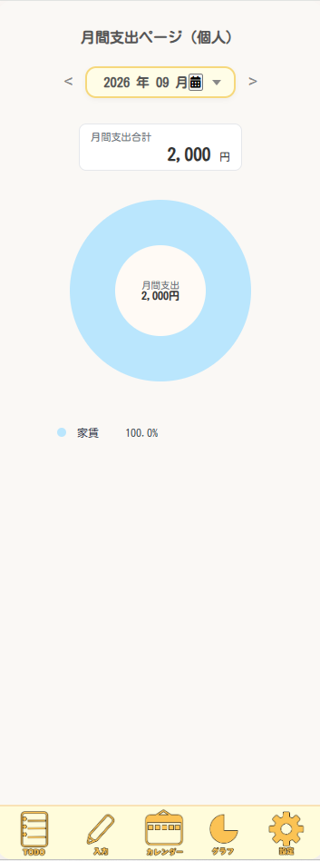
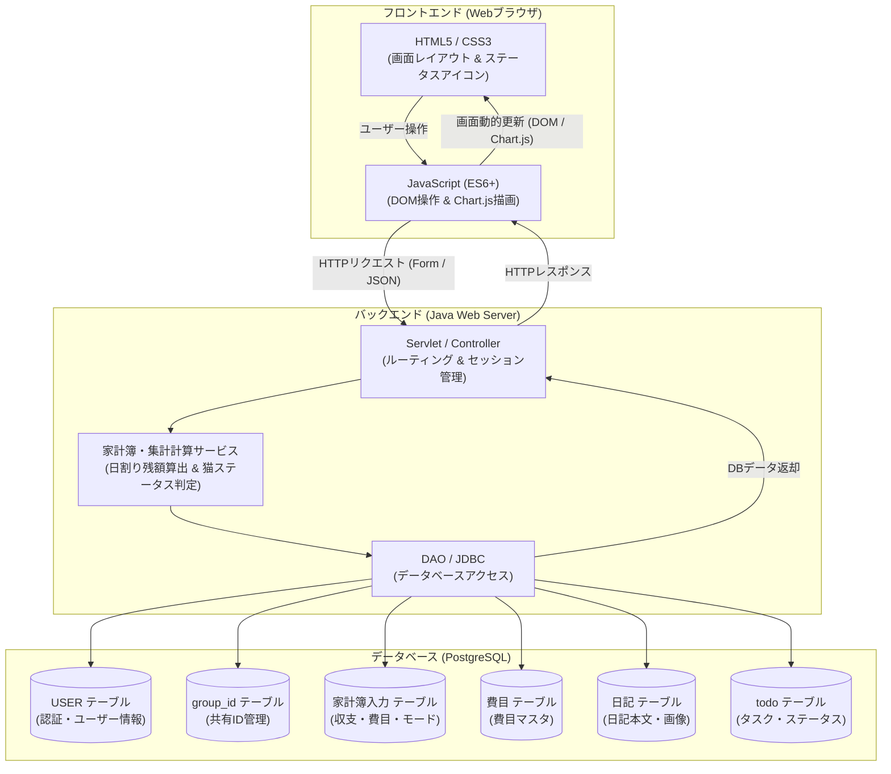

# アプリケーション「ねこぜ家計簿」

[](https://openjdk.org/)
[](https://tomcat.apache.org/)
[](https://www.postgresql.org/)
[](https://aws.amazon.com/)
[](https://www.chartjs.org/)
[](https://www.eclipse.org/)
[](https://a5m2.mmatsubara.com/)
[](https://antigravity.google/)

「ねこぜ家計簿」は、日々の家計簿・TODOリスト・写真付き日記を一元管理し、当月予算達成へのモチベーションを高めるギミック（猫の姿勢ステータス）を搭載したWebアプリケーションです。  
個人の収支管理はもちろん、共有ID（グループ機能）を用いることでパートナーやご家族との家計簿共有・閲覧にも柔軟に対応しています。

> [!NOTE]  
> **本プロジェクトは、JavaWeb研修時に作成したコンテンツ（ポートフォリオ）です。**  
> * **開発期間**: 26日 (要件定義、基本設計、詳細設計、実装、テスト)
> * **開発規模**: 2.8Kstep  

---

## 📑 目次
1. [💻 画面イメージ](#-画面イメージ)
2. [✨ 主な機能・要件](#-主な機能要件)
3. [🐱 コンセプト・モチベーションギミック](#-コンセプトモチベーションギミック)
4. [🧰 使用技術・開発環境](#-使用技術開発環境)
5. [📐 システム構成・処理フロー](#-システム構成処理フロー)
6. [🌐 動作確認（デモ環境）](#-動作確認デモ環境)
7. [📖 要件定義書・画面設計書](#-要件定義書画面設計書)
8. [🛠️ ローカル環境での実行・セットアップ手順](#️-ローカル環境での実行セットアップ手順)
9. [💡 工夫した点](#-工夫した点)
10. [🧗 苦労した点・得られた教訓](#-苦労した点得られた教訓)

---

## 💻 画面イメージ

*(※ 掲載している画像はシステム画面の一部抜粋です。全画面イメージや詳細な画面フローは [要件定義書・画面設計書](#-要件定義書画面設計書) よりご覧いただけます)*

| 月間カレンダー（プライベート）<br><sub>※一部抜粋</sub> | 収支分析グラフ（月支出）<br><sub>※一部抜粋</sub> |
| :---: | :---: |
|  |  |
| 月ごとの収支合計・日別明細をカレンダー上で視覚的に把握 | 費目別割合や推移グラフによる収支状況の分析 |

---

## ✨ 主な機能・要件

* 💰 **家計簿・収支管理**
  * 支出・収入の直感的な登録（金額、支出種別【収入/固定/変動/投資・貯蓄】、費目22種、メモ、日付）
  * 当月利用可能残額および「本日利用可能額（日割り予算）」のリアルタイム自動算出
* 🐱 **ねこステータス機能**
  * 日割り予算の使用率に応じて動的に猫のイラスト（寝そべり / 姿勢良い / 猫背）を変化させ、節約意識・モチベーションを維持
* 📅 **カレンダー機能 (Monthly / Day)**
  * 月次・日別カレンダー形式で収支・予定を視覚化。プライベートモードと共有（シェア）モードの切替対応
* 📊 **多角的収支グラフレポート (Chart.js)**
  * 日別・月別・年別の支出データをカテゴリ別・費目別に集計・可視化
* 📝 **写真付き日記機能**
  * カレンダーの日別画面から、思い出や出来事を写真（バイナリ画像保存）付きで記録・閲覧
* ✅ **TODOリスト・アイデアメモ**
  * 今日のタスクや買い物リスト、アイデアの管理（チェックボックスによる完了判定・グレーアウト消し線表示）
* 🔐 **認証・アカウント・グループ共有機能**
  * BCryptハッシュ化による安全なユーザー登録・ログイン・秘密の質問によるパスワード再設定
  * 8桁の共有ID発行・認証によるパートナーやご家族との家計データ共有

---

## 🐱 コンセプト・モチベーションギミック

家計簿の継続利用を促すため、当月収入・固定支出・日割り予算に基づき**本日使用率**を自動計算し、ねこの姿勢アニメーションGIF（ステータス）を動的に切り替えます。

$$ \text{日割り残額} = \frac{\text{当月収入} - (\text{固定支出} + \text{変動支出} + \text{投資・貯蓄})}{\text{当月残日数}} $$

| ステータス | 本日使用率 | 表示される猫の様子 (アニメーションGIF) |
| :--- | :--- | :---: |
| **良い (Good)** | `0% 〜 70% 未満` | <br><sub>余裕がある状態（寝そべりねこ）</sub> |
| **普通 (Normal)** | `70% 〜 100% 以下` | <br><sub>計画通りの状態（姿勢良いねこ）</sub> |
| **悪い (Warning)** | `100% 超 (予算オーバー)` | <br><sub>予算オーバー注意（猫背ねこ）</sub> |

---

## 🧰 使用技術・開発環境

| カテゴリ | 技術スタック / バージョン |
| :--- | :--- |
| **開発期間** | 26日 |
| **開発規模** | 2.8Kstep |
| **言語・ランタイム** | Java 21 / 25 (OpenJDK) |
| **フロントエンド** | HTML5, CSS3, JavaScript (ES6+), Chart.js |
| **Webコンテナ / APサーバ** | Apache Tomcat 10.1 / 11 |
| **バックエンド** | Java (Jakarta Servlet / JSP / MVCパターン) |
| **セキュリティ** | jBCrypt (パスワード・秘密の質問のハッシュ化) |
| **データベース** | PostgreSQL 16 (または 18.1) |
| **インフラ / ホスティング** | AWS (EC2) |
| **統合開発環境 (IDE)** | Eclipse |
| **DB管理・設計ツール** | A5:SQL Mk-2 |
| **開発支援（AI）** | Antigravity |

---

## 📐 システム構成・処理フロー



---

## 🌐 動作確認（デモ環境）

AWS上にデプロイしており、実際に動作をご確認いただけます。

👉 **[「nekozekakeibo」デモサイトはこちら](http://13.193.142.78/neko/)**  
*(※別タブで開く場合は `Ctrl + クリック` / `Cmd + クリック` 推奨)*

> **テスト用ログイン情報**  
> * **ID**: `guest@example.com`  
> * **パスワード**: `password123`

---

## 📖 要件定義書・画面設計書

👉 **[Web版 要件定義書・画面設計書はこちら（GitHub Pages）]()**  
*(※リンクを別タブで開く場合は `Ctrl + クリック`（Macは `Cmd + クリック`）してください)*  
*(※詳細な要件定義書・画面仕様・処理フローをWebページ形式でご覧いただけます)*

---

## 🛠️ ローカル環境での実行・セットアップ手順

ローカル環境で本プロジェクトを実行する場合は、以下の環境準備、データベースのセットアップ、およびデータベース接続設定が必要です。

### 1. 前提条件
* **Java**: JDK 21 以上
* **Webコンテナ**: Apache Tomcat 10.1 以上 (Jakarta EE 10対応)
* **データベース**: PostgreSQL 16 以上

### 2. データベースの構築（テーブルの生成）
プログラムの実行に必要なテーブル群を生成してデータを追加するために、公開しているテーブル生成用SQL（[`create_tables.sql`](create_tables.sql)）を実行してください。

PostgreSQLにて以下の6つのテーブル構造を作成します（データベース名例: `nekozebudget`）。

* **主要テーブル構成**:
  * `public."USER"` (user_id, mail_address, password, user_name, nickname, secret_question, secret_answer, group_id, user_icon)
  * `public."家計簿入力"` (id, user_id, date, memo, yen, category_type, mode, himoku_id)
  * `public."費目"` (himoku_id, himoku_name, category_type)
  * `public."日記"` (id, user_id, date, photo, content, mode)
  * `public.todo` (id, user_id, todo, idea, status)
  * `public.group_id` (group_id, created_by)

。

### 3. データベース設定ファイルの作成
`/src/main/java/` 配下に `db.properties` を作成し、ローカルDB環境に合わせた接続情報を設定してください。

#### `db.properties` の記述例
```properties
db.url=jdbc:postgresql://localhost:5432/データベース名
db.user=ユーザ名
db.password=パスワード
db.driver=org.postgresql.Driver
```

---

## 💡 工夫した点

### 1. 予算達成への意識を高める「ねこステータス」判定
* 当月の利用可能残額を自動計算し、日割り予算の使用率に応じてモチベーションアイコン（猫の姿勢）を動的に切り替えるロジックを実装しました。単なる数字の管理にとどまらず、楽しく節約を継続できるUI/UXを工夫しました。

### 2. 個人用・共有用のシームレスなモード切替機能
* 単一のアカウント内でプライベートモードと共有（シェア）モードをワンタップで切り替えられる設計を採用しました。グループ共有時も不要な情報混入を防ぎ、プライバシーと利便性を両立させています。

### 3. 多角的な視覚化（カレンダー & Chart.jsグラフレポート）
* 日別の収支一覧だけでなく、費目別・カテゴリ別の円グラフや年次推移グラフをChart.jsで動的に描画し、ユーザーが直感的に支出傾向を把握できるようにしました。

### 4. 日記機能
* 日記に写真とメモを保存できるようにしました。家計簿だけでなく日記機能を付けることで、思い出を記録しながら節約を継続できるような工夫をしました。
* 共有IDを使うことで、家族や友人と思い出を共有できるようにしました。

---

## 🧗 苦労した点・得られた教訓

### セキュリティと共有ロジック・開発プロセスの調整
パスワードのBCryptハッシュ化やセッション固定化攻撃対策（ログイン時のセッション再生成）を導入した際、グループ共有データへのアクセス権限判定との整合性を保つ点に苦労しました。また、AIを活用したコーディング支援の導入時には、適切な指示（プロンプト）の出し方や設計書の明確化に試行錯誤しました。

この経験から、以下の教訓を得ることができました。
1. **セキュリティ認証と認可ロジックの明確な切り分けの重要性**
2. **データベース設計段階におけるマルチユーザー・共有データ用リレーション設計の精度向上**
3. **継続的なリファクタリングによる保守性と拡張性の担保**
4. **AI活用における指示内容の明確化と生成結果に対する検証徹底**
